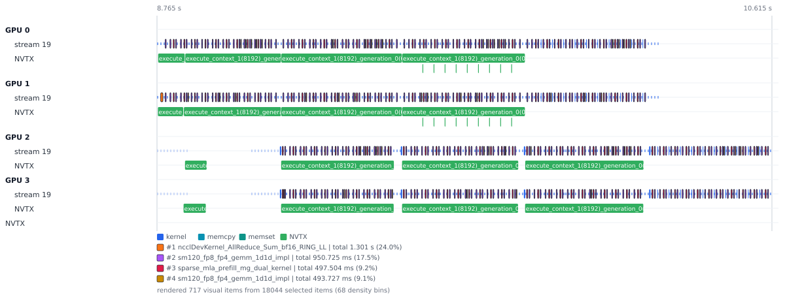
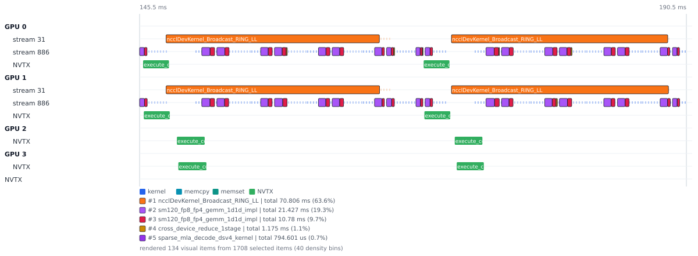
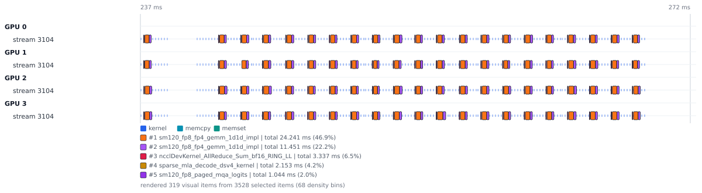

# Example Agent Report: NSys Timeline Evidence With VeloQ

This is a scrubbed example of a report an agent can produce from Nsight Systems
timeline evidence using VeloQ. The workload is a multi-GPU inference profile
with tensor-parallel and pipeline-parallel variants. The point of the example
is the workflow: bounded profile queries, static timeline SVGs, top-k kernel
highlights, and a short interpretation that a human can review without opening
the Nsight Systems GUI.

The trace names, local paths, and environment details are intentionally omitted.
The measurements are example evidence from one scrubbed capture, not a benchmark
claim for any model, hardware, framework, or serving stack.

## Executive Summary

The profile comparison has one useful story: local GPU overlap is not the same
thing as end-to-end step latency.

| Case                 | Timeline evidence                                                                                 | Human interpretation                                                                                      |
| -------------------- | ------------------------------------------------------------------------------------------------- | --------------------------------------------------------------------------------------------------------- |
| Hybrid TP/PP prefill | A long prefill envelope shows device groups offset across the window.                             | Pipeline stages are filled across chunks; this is a stage-shape figure, not a per-event label view.       |
| Hybrid TP/PP decode  | A short decode stream view shows NCCL broadcast and GEMM work overlapping on the active devices.  | Local communication/compute overlap is strong, but pipeline handoff still matters for end-to-end latency. |
| Pure TP decode       | A matched short decode window shows synchronized per-device work dominated by GEMM and AllReduce. | For this selected window, the pure TP shape is simpler and the measured decode step is shorter.           |

## How to Read the Figures

The figures below are static SVG artifacts produced by `veloq viz timeline`.
They preserve the bounded time window, resolved tracks, base event legend, and
top-k kernel highlights. Full event names remain in SVG titles/tooltips even
when labels are clipped.

Dense windows use per-track density markers for events that are too small or too
numerous to draw as individual readable bars. Density markers are visual
compaction, not query filtering: the render metadata reports selected,
rendered, density-aggregated, omitted, suppressed-label, and truncated-label
counts.

## Figure 1: Hybrid TP/PP Prefill Pipeline Envelope



This 1.85s window covers a dense prefill envelope. The figure uses a
stream-focused view rather than every available track. The important visual cue
is the offset between device groups: GPUs 0/1 and GPUs 2/3 are not simply
running the same work at the same time. The NVTX lane is retained so the stage
pattern remains visible.

Top highlighted kernel groups in the figure:

| Rank | Kernel short name                          |   Highlight score |
| ---: | ------------------------------------------ | ----------------: |
|    1 | `ncclDevKernel_AllReduce_Sum_bf16_RING_LL` |    1.301 s, 24.0% |
|    2 | `sm120_fp8_fp4_gemm_1d1d_impl`             | 950.725 ms, 17.5% |
|    3 | `sparse_mla_prefill_mg_dual_kernel`        |  497.504 ms, 9.2% |
|    4 | `sm120_fp8_fp4_gemm_1d1d_impl`             |  493.727 ms, 9.1% |

Figure metadata: 18,044 selected events, 717 rendered visual items, 68 density
markers representing 16,625 density-aggregated events, 633 suppressed labels,
16 truncated labels, and 770 omitted subpixel annotation items. This is
intentionally a high-density stage-shape figure rather than a per-event label
view.

## Figure 2: Hybrid TP/PP Decode Local Overlap



This 45ms decode window contains both communication and compute. The highlighted
legend keeps NCCL Broadcast, GEMM, and cross-device reduce visible in one
bounded stream view. That makes the overlap visible without requiring the reader
to inspect thousands of individual interval labels.

Top highlighted kernel groups:

| Rank | Kernel short name                 |  Highlight score |
| ---: | --------------------------------- | ---------------: |
|    1 | `ncclDevKernel_Broadcast_RING_LL` | 70.806 ms, 63.6% |
|    2 | `sm120_fp8_fp4_gemm_1d1d_impl`    | 21.427 ms, 19.3% |
|    3 | `sm120_fp8_fp4_gemm_1d1d_impl`    |  10.780 ms, 9.7% |
|    4 | `cross_device_reduce_1stage`      |   1.175 ms, 1.1% |
|    5 | `sparse_mla_decode_dsv4_kernel`   | 794.601 us, 0.7% |

Figure metadata: 1,708 selected events, 134 rendered visual items, 40 density
markers representing 1,566 density-aggregated events, and 48 omitted subpixel
annotation items. Short NVTX labels are clipped to their interval bars; full
names remain available in SVG tooltips.

## Figure 3: Pure TP Decode Contrast



This 35ms pure-TP decode window is a useful contrast against the hybrid TP/PP
decode window. The visible pattern is more synchronized across devices, with
GEMM and NCCL AllReduce dominating the highlighted work. In this selected
window, the pure-TP step is shorter than the hybrid TP/PP decode step.

Top highlighted kernel groups:

| Rank | Kernel short name                          |  Highlight score |
| ---: | ------------------------------------------ | ---------------: |
|    1 | `sm120_fp8_fp4_gemm_1d1d_impl`             | 24.241 ms, 46.9% |
|    2 | `sm120_fp8_fp4_gemm_1d1d_impl`             | 11.451 ms, 22.2% |
|    3 | `ncclDevKernel_AllReduce_Sum_bf16_RING_LL` |   3.337 ms, 6.5% |
|    4 | `sparse_mla_decode_dsv4_kernel`            |   2.153 ms, 4.2% |
|    5 | `sm120_fp8_paged_mqa_logits`               |   1.044 ms, 2.0% |

Figure metadata: 3,528 selected events, 319 rendered visual items, and 68
density markers representing 3,277 density-aggregated events. The density
markers keep the whole selected window visible while keeping the committed SVG
compact.

## Evidence Chain

The report is not a screenshot pasted into Markdown. Each figure comes from the
same bounded evidence chain:

```bash
# Figure 1: stream-focused prefill view with NVTX context.
veloq viz timeline TRACE \
  --from @START_NS \
  --to @END_NS \
  --track cuda-streams:device=all,top=4 \
  --track nvtx:depth=1 \
  --highlight-kernels top=4,scope=name \
  --width 1200 \
  --density-bin-px 48 \
  --max-items 800

# Figure 2: stream-focused decode view with NVTX context.
veloq viz timeline TRACE \
  --from @START_NS \
  --to @END_NS \
  --track cuda-streams:device=all,top=4 \
  --track nvtx:depth=1 \
  --highlight-kernels top=5,scope=name \
  --width 1200 \
  --density-bin-px 48 \
  --max-items 800

# Figure 3: stream-only contrast view.
veloq viz timeline TRACE \
  --from @START_NS \
  --to @END_NS \
  --track cuda-streams:device=all,top=4 \
  --highlight-kernels top=5,scope=name \
  --width 1200 \
  --density-bin-px 48 \
  --max-items 800
```

For each figure, VeloQ returns a JSON envelope with the artifact path, resolved
tracks, render counters, density counters, and `resolved_highlights[]`. The
committed [`evidence/summary.json`](evidence/summary.json) keeps only portable
metadata from those envelopes.

## What This Demonstrates

VeloQ lets an agent move from profile trace to reviewable report without a GUI:

- use JSON commands to inspect the trace and select a bounded window;
- export static SVG timeline figures from the CLI;
- highlight top kernels with score and percentage share in the legend;
- keep dense windows visible as per-track density markers with count metadata;
- cite the matching JSON evidence in the text; and
- hand a human a Markdown report with embedded, inspectable SVGs.
